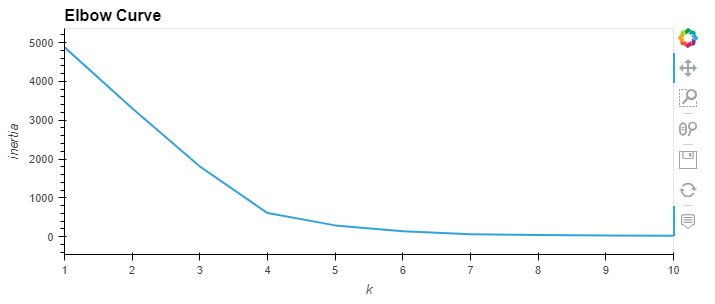
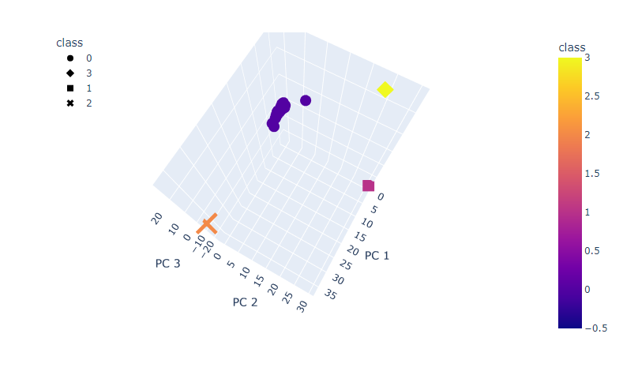

# cryptocurrencies

Leveraging unsupervised machine learning methods to study different features in the data to classify cyrptocurrencies. We do not know what the output is here. So it is interesting to see how the algorithm will classify the cryptocurrencies.

## Results
The data was first cleaned using pandas and we used a clustering algorithm.

I created an elbow curve to determine how many clusters should be used. I used 4 clusters as shown in the elbow curve below.  
  

Next we did a principal component analysis and the PC factors were plotted in the 4 clusters as shown below.  

